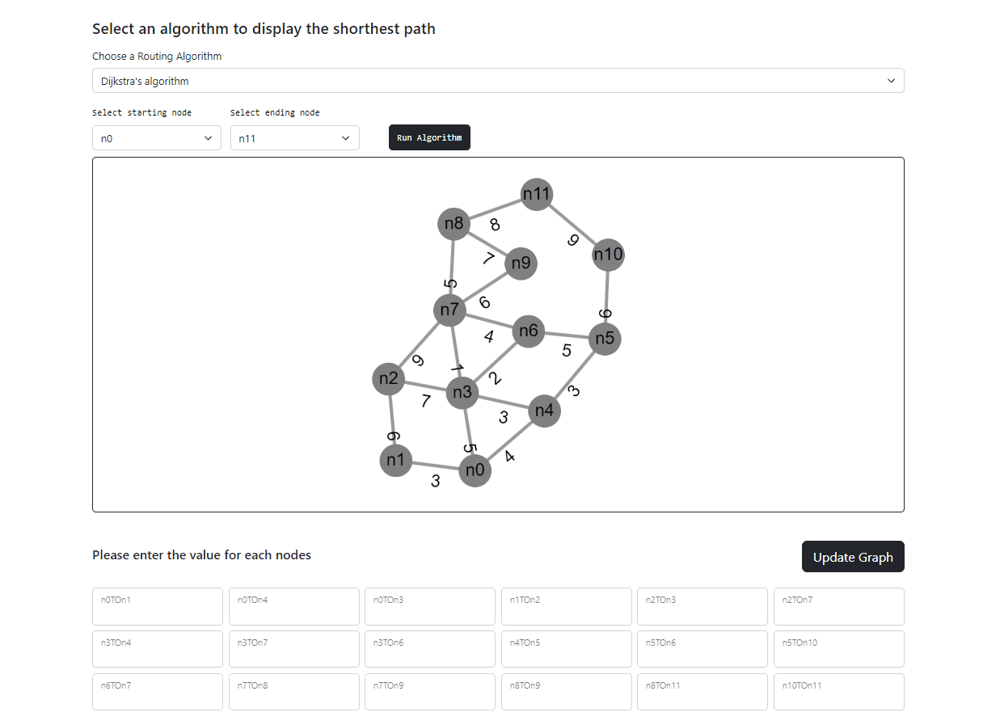
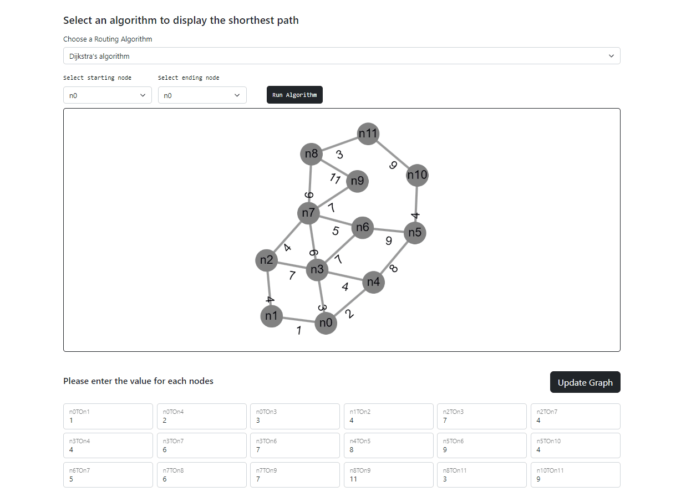

## User Manual

1. Update the Graph with the desired edge weights

2. Choose one of the two Routing Algorithm

3. Choose the starting and ending nodes from the two drop-down menus, then click the `Run Algorithm` button. The Algorithm from step 2 will be executed. The shortest path between the two selected nodes will be highlighted on the graph, and a table containing relevant data will be generated.

